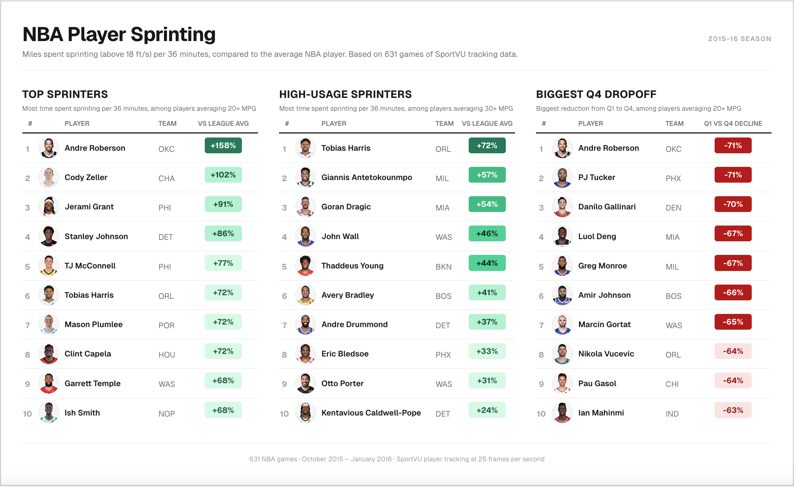

# NBA Player Sprinting — 2015-16 Season

> How much of each game does a player spend sprinting? Who fades in the fourth quarter?

Built using raw SportVU player tracking data — 25 frames per second, (x,y) positions for all 10 players on the court, across 631 games from October 2015 through January 2016.

---

## Notebooks

### [`nba_tracking_experiments.ipynb`](nba_tracking_experiments.ipynb)
League-wide sprinting and movement analysis across the full dataset.

- **Top Sprinters** — who covers the most distance above 18 ft/s per 36 minutes, regardless of playing time
- **High-Usage Sprinters** — same metric filtered to players averaging 30+ minutes per game
- **Biggest Q4 Dropoff** — which players show the largest decline in sprinting activity from Q1 to Q4
- **Speed leaderboard** and total miles leaders across the season

### [`pnr_defense.ipynb`](pnr_defense.ipynb)
Pick-and-roll defense classification for the New York Knicks across 20 games.

- Hungarian algorithm for defensive assignment matching
- Rule-based coverage classification: Drop, Ice, Hedge, Catch-and-Hedge, Blitz
- Outcome matching via play-by-play join
- FG% and points per possession by coverage type

### [`data_collection.ipynb`](data_collection.ipynb)
Raw data processing pipeline. Runs once to build `season_stats.csv` and `player_stats.csv` from the game archives.

- Deduplicates the ~3x event overlap present in the raw SportVU format
- Computes per-frame velocities with 5-frame rolling smoothing
- Captures sprinting distance at three thresholds (15, 18, 20 ft/s) so analysis can be run at any threshold without reprocessing

---

## Data

[nba-movement-data](https://github.com/linouk23/nba-movement-data) — publicly available SportVU tracking data from the 2015-16 NBA season (October 2015 – January 2016, 631 games).

Raw format: one JSON per game, each moment containing (x, y) coordinates for all 10 players and the ball at 25 fps.

---

## Key Findings

- **Sprint threshold matters**: at 15 ft/s, bigs dominate the leaderboard due to their size advantage covering ground. At 18 ft/s the list shifts toward guards and wings as expected.
- **Q4 dropoff is real and position-specific**: centers and power forwards show the largest declines in sprint activity from Q1 to Q4 (60–70%), likely due to fatigue from physical play in the paint. Note this metric also captures game situation — teams with a large lead run fewer sprints in Q4.
- **Andre Roberson** appears in both Top Sprinters (#2) and Biggest Q4 Dropoff (#1) — the player who sprints hardest also fades the most.
